# 计算机图形学
## 第三次上机作业
#### 编程环境

- 编程语言：java1.8

- 编译器：eclipse

- 项目管理：maven

- *PS:*

  

- 代码已经放在github网站。代码随着老师布置的上机作业在不断更新，老师可以随时查阅代码细节。

- 网站地址：https://github.com/MagnetoWang/ComputerGraphics

#### 编程说明

主要演示文件在 ComputerGraphics\src\main\java\Curve目录下

分别对应着MathCurve.java , Hermite.java , MoveCureve 这个三个文件有对应的函数。老师只需要注释某一行，再增加某一行就可以看到对应的效果图了

#### 一. 画出已知公式的曲线

这个题目我觉的有点奇怪。最终画出的曲线似乎类似。都是递增的曲线。

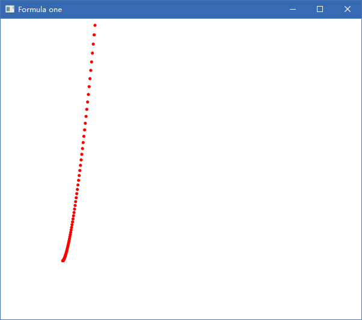

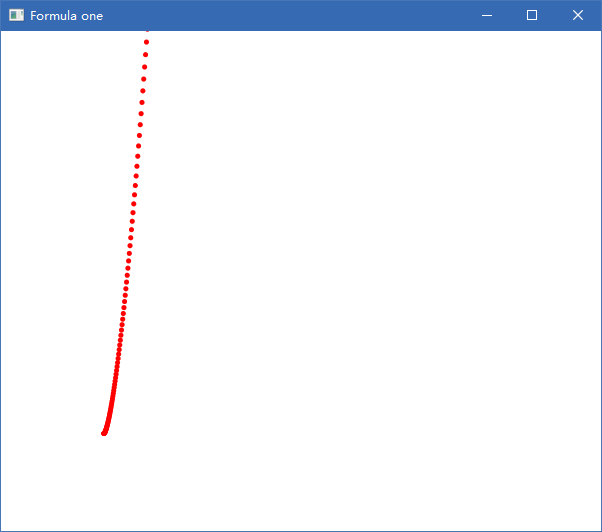

#### 二. 已知hermite参数，画出对应曲线同时修给切向量查看效果

这个题目比较简单，写好公式，在代入对应点和点的切向量。期间还尝试了如何画圆效果都还可以

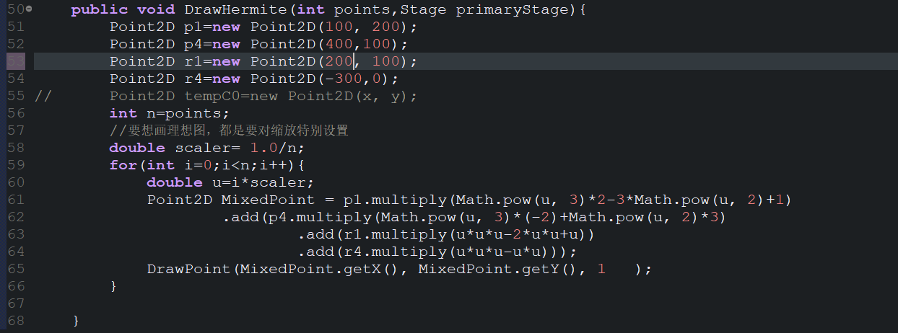

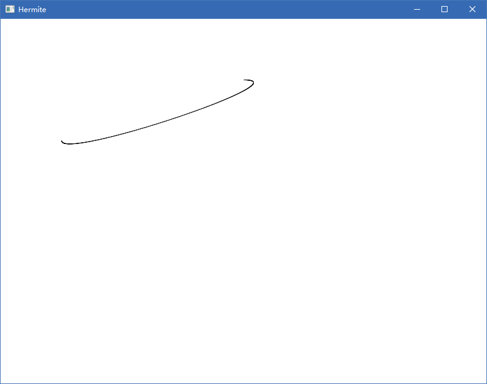

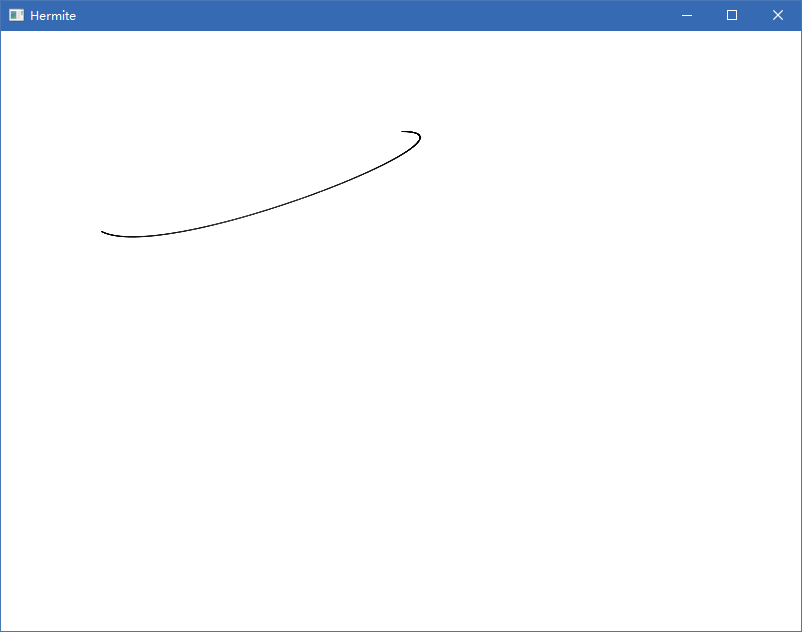

#####　接下来是自己尝试的切向量和随意点

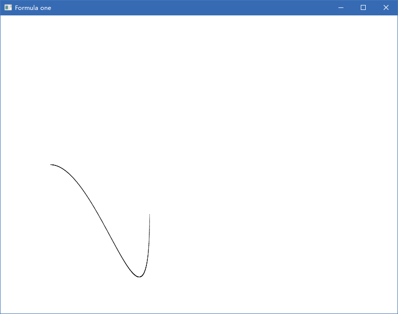

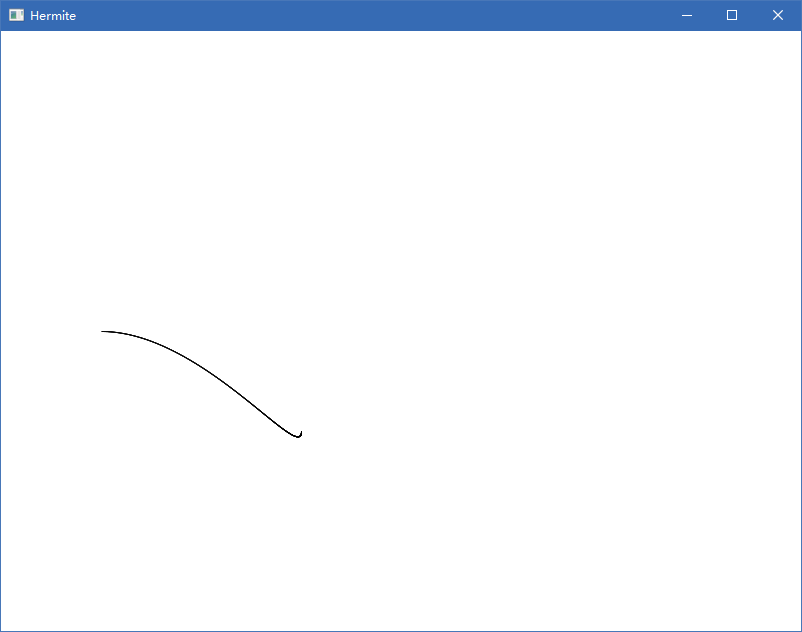

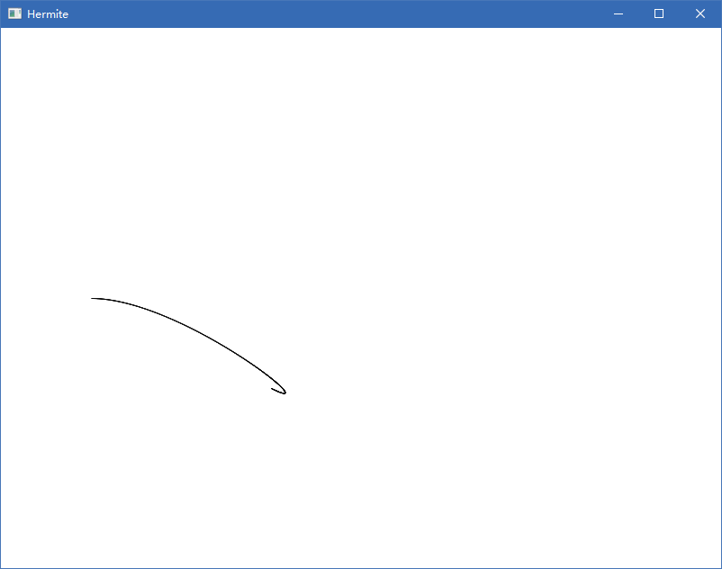

####  三.编写程序，使一物体沿着一条直线匀速移动

因为都是用的一个画板，我忘记改窗口标题了。用的hermite的窗口

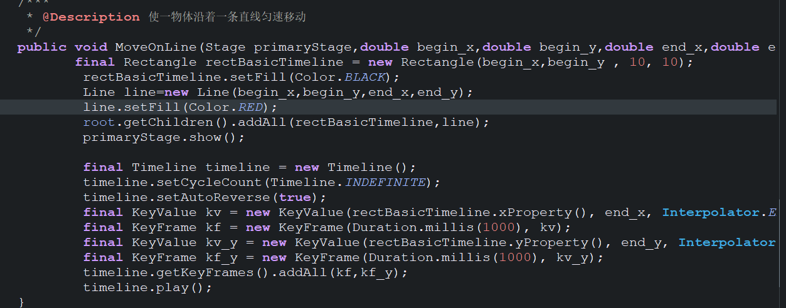

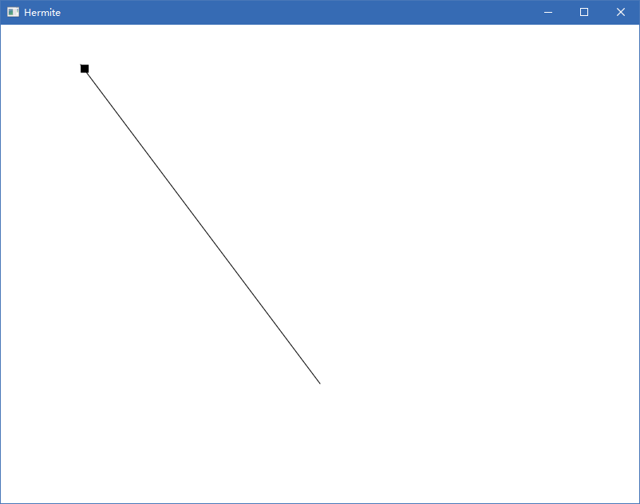

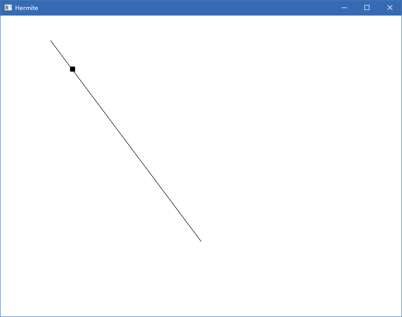

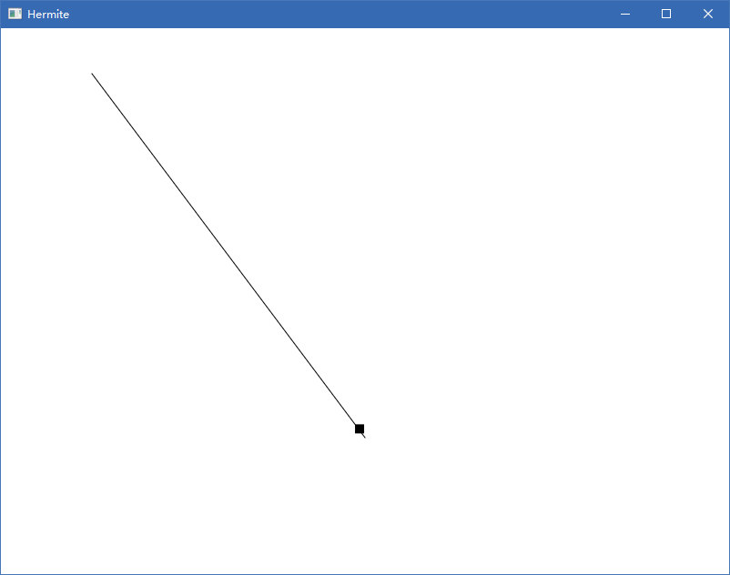

####　**四．编写程序，使一物体围绕屏幕上一点匀速旋转** 

旋转一般都是围绕一个圆。为了使题目更加有意思些。我采取自己使用bezier曲线画圆，不使用内置库。显然用bezier画圆，在控制点方面，要计算好位置才行

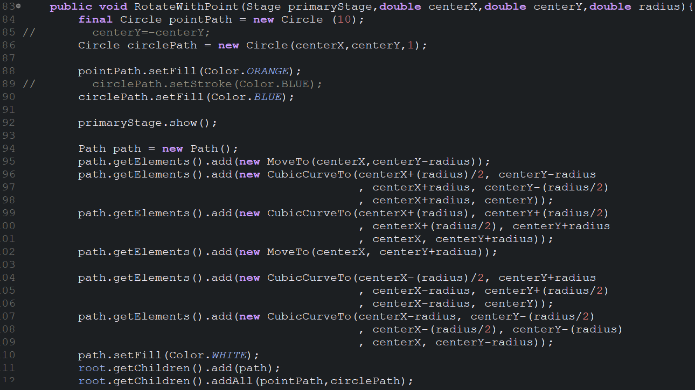

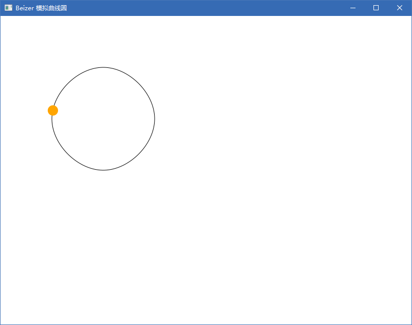

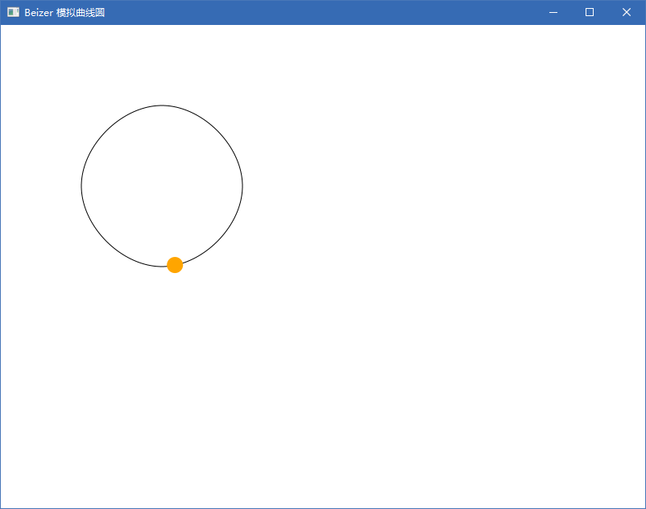

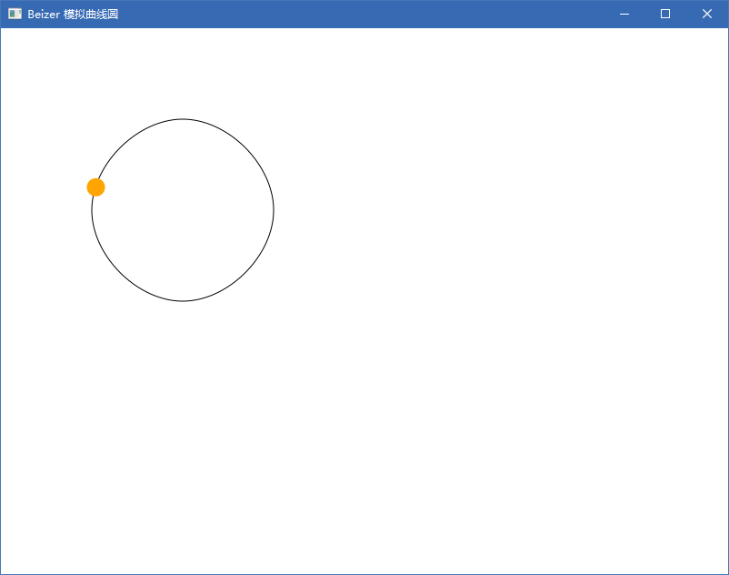

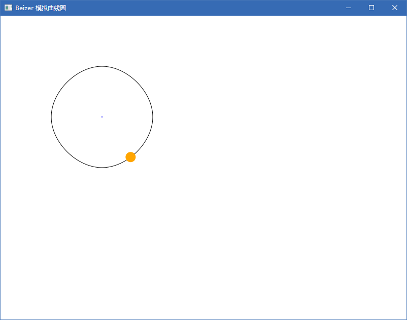

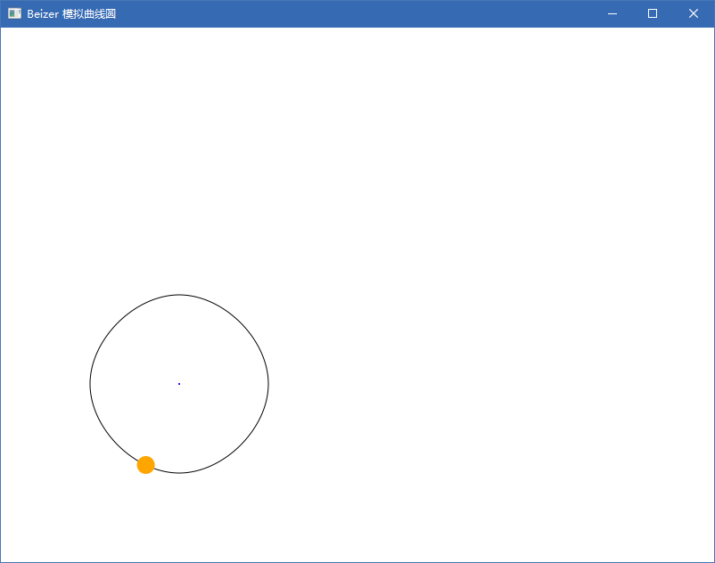

