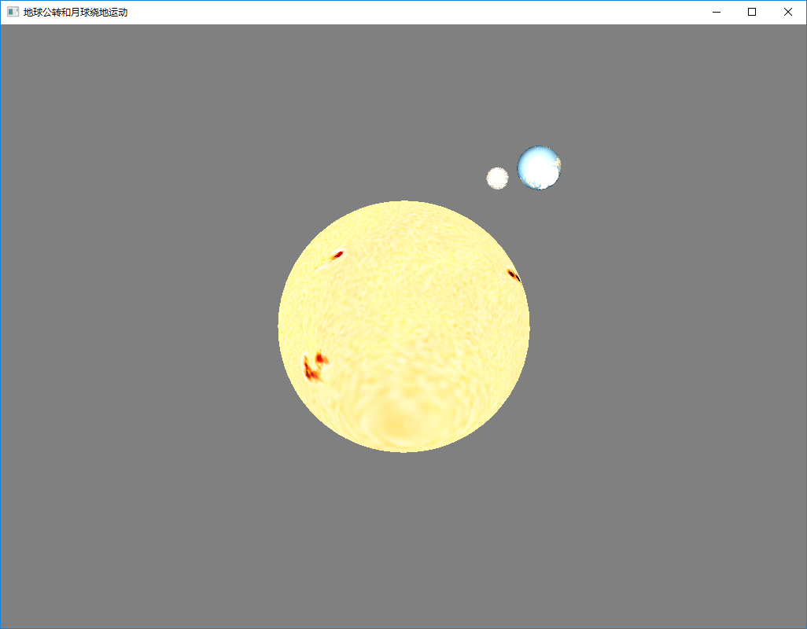
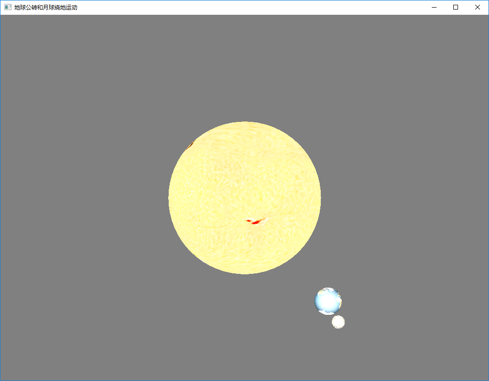
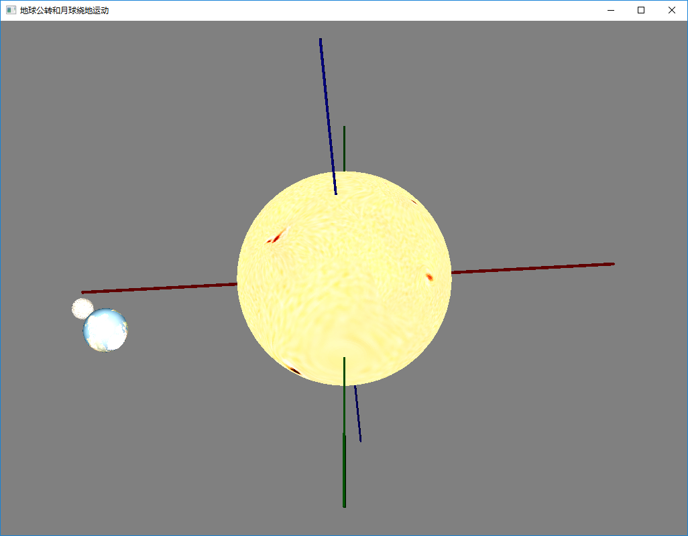
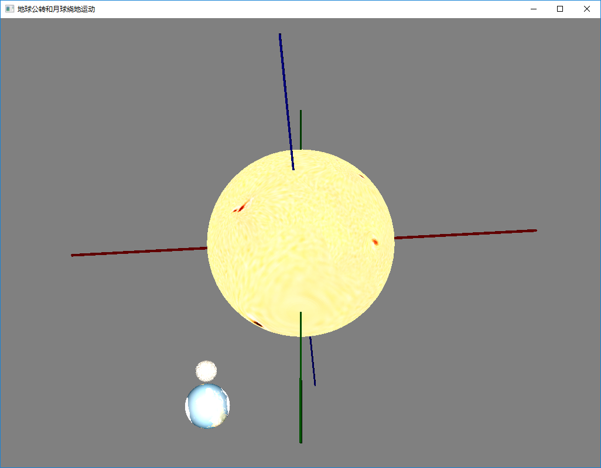
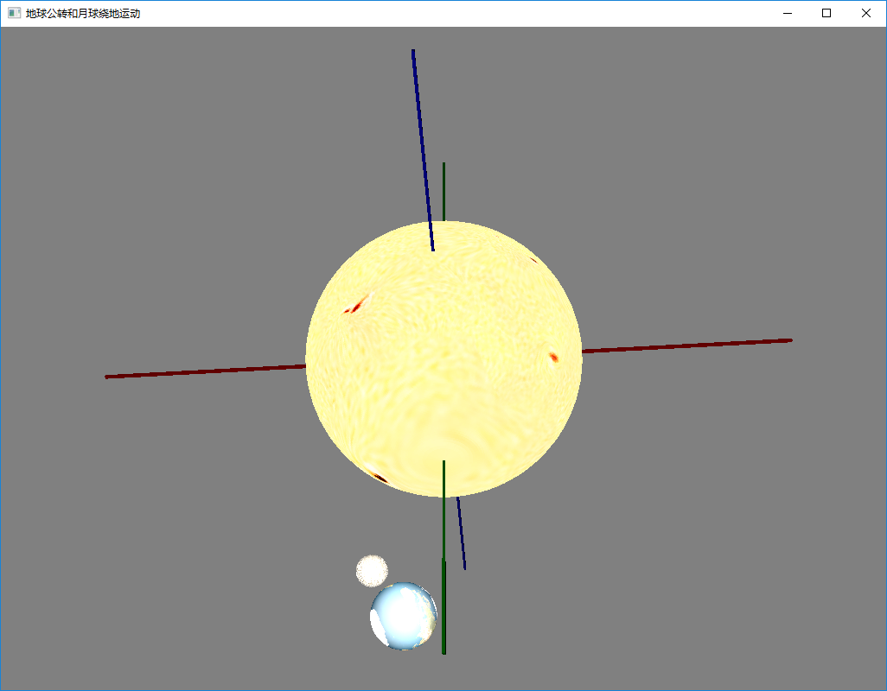

# 计算机图形学
# 第五次上机作业
#### 编程环境

- 编程语言：java1.8
- 编译器：eclipse
- 项目管理：maven
- *PS:*
- 代码已经放在github网站。代码随着老师布置的上机作业在不断更新，老师可以随时查阅代码细节。
- 网站地址：https://github.com/MagnetoWang/ComputerGraphics
- 选择Java的原因，跨平台，开发环境的安装时间成本几乎为0


#### 编程说明

主要演示文件在 ComputerGraphics\src\main\java\solorSystems\solor.java  地球公转加月球绕地球

ComputerGraphics\src\main\java\threeD\Teapot.java  茶壶效果

#### 一. 光照

第四次实验已经加入光照效果了。所以就直接放图了

效果图

#### 


二. **模拟简单的太阳系统**

因为时间容易设置。为了简单的看到效果。就把时间按比例缩短成秒的单位

核心代码

```java
private static void animateSphere(Group group) {
		Rotate rot = new Rotate();
		Translate radiusTranslate = new Translate(100, 50, 0);
		Translate xMovement = new Translate();
		group.getTransforms().setAll(xMovement, rot, radiusTranslate);
		Timeline tl = new Timeline(
				new KeyFrame(Duration.seconds(365),
						new KeyValue(xMovement.yProperty(), 0d, Interpolator.LINEAR),
						new KeyValue(rot.angleProperty(), 720, Interpolator.LINEAR))
		);
		tl.setCycleCount(Timeline.INDEFINITE);
		tl.play();
	}
	private static void animateSphere1(Sphere moon,Sphere earth){
		CylinderCoordinateAdapter adapter = new CylinderCoordinateAdapter(
			earth_moon.translateXProperty(),
			earth_moon.translateYProperty(),
			earth_moon.translateZProperty());
		CylinderCoordinateAdapter mooon_ada=new CylinderCoordinateAdapter(
			moon.translateXProperty(),
			moon.translateYProperty(),
			moon.translateZProperty());

		adapter.setRadius(0);
		mooon_ada.setRadius(20);
		Timeline t2 = new Timeline(
				new KeyFrame(Duration.seconds(4),
						new KeyValue(mooon_ada.hProperty(), 0d, Interpolator.LINEAR),
						new KeyValue(mooon_ada.thetaProperty(), Math.PI *6, 									Interpolator.LINEAR))
		);
		t2.setCycleCount(Timeline.INDEFINITE);
		t2.play();

	}
```
















