# 计算机图形学
# 第四次上机作业
#### 编程环境

- 编程语言：java1.8
- 编译器：eclipse
- 项目管理：maven
- *PS:*
- 代码已经放在github网站。代码随着老师布置的上机作业在不断更新，老师可以随时查阅代码细节。
- 网站地址：https://github.com/MagnetoWang/ComputerGraphics
- 选择Java的原因，跨平台，开发环境的安装时间成本几乎为0

#### 编程说明

主要演示文件在 ComputerGraphics\src\main\java\Color  , Curve  和  threeD 

#### 一. 绘制曲线

因为上一次实验用过bezier曲线。所以这次很容易画。

效果图

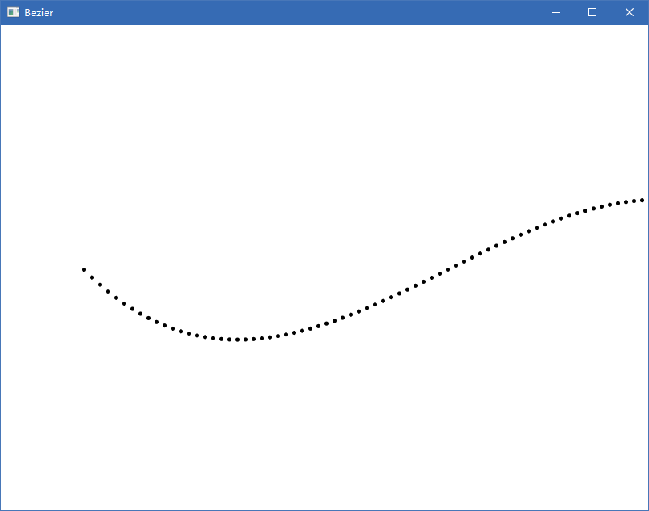

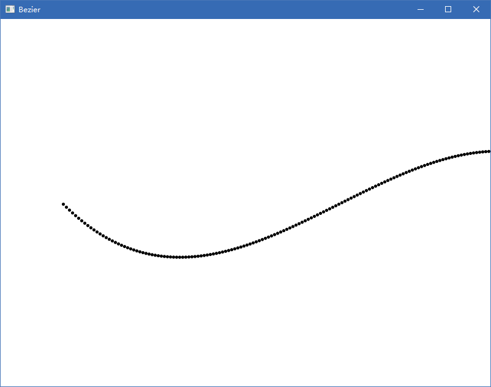

实验代码和数据

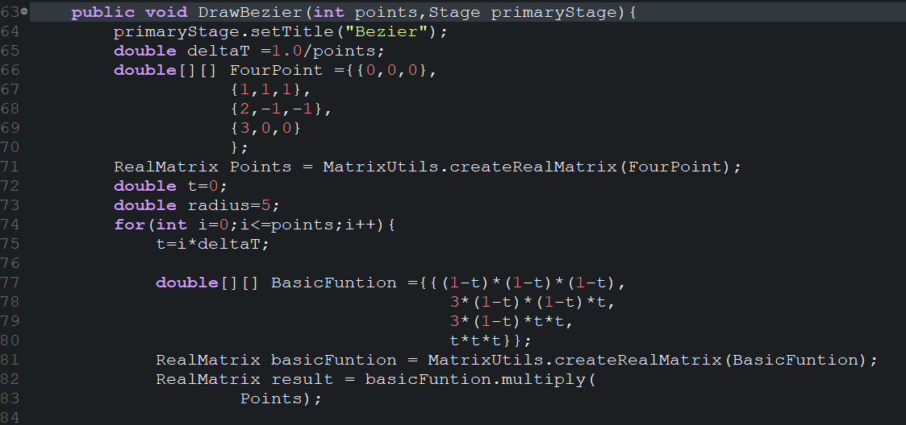

Bezier曲线

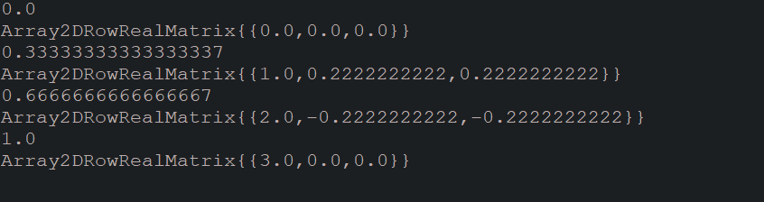

 B样条曲线

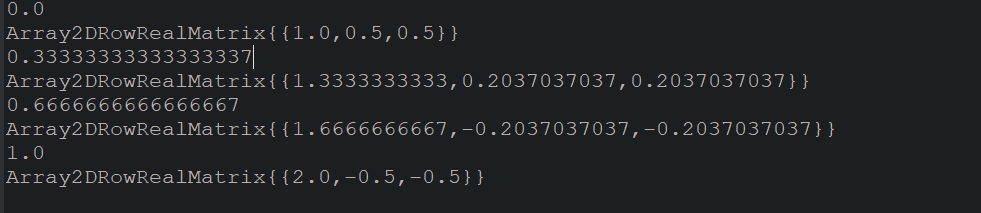

#### 二.绘制曲面 

为画茶壶的效果更加完美。在已有的曲线点上新增贴图，光线和鼠标移动效果

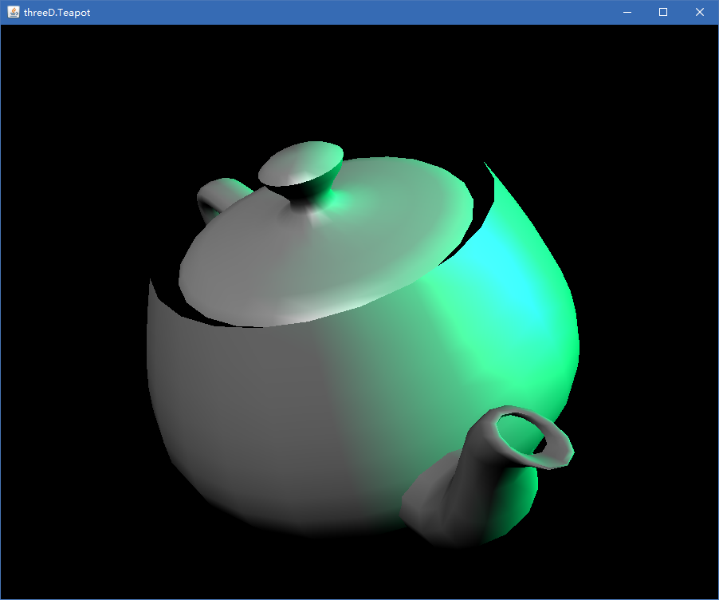

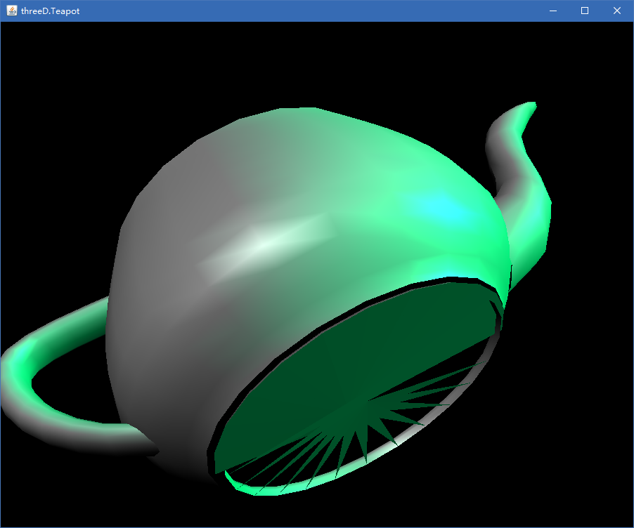

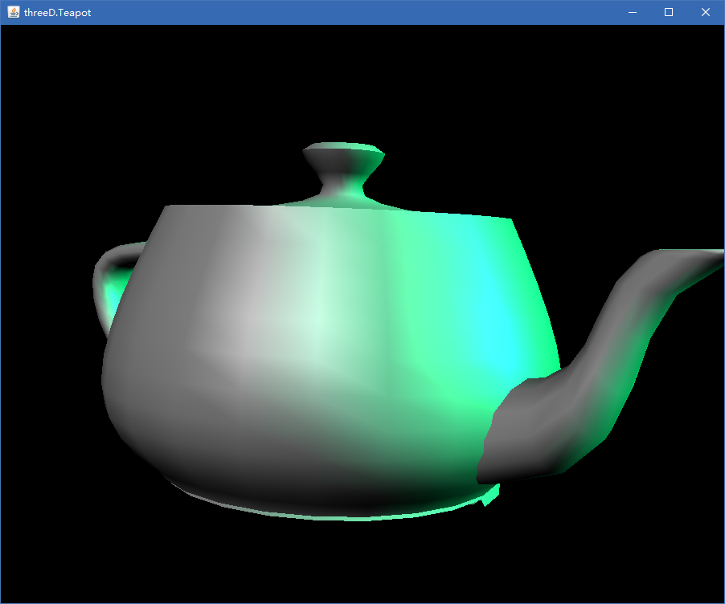

#### 三.颜色

##### 1.颜色线性差值

为了效果更加好看。我增加了不同颜色的线性变化

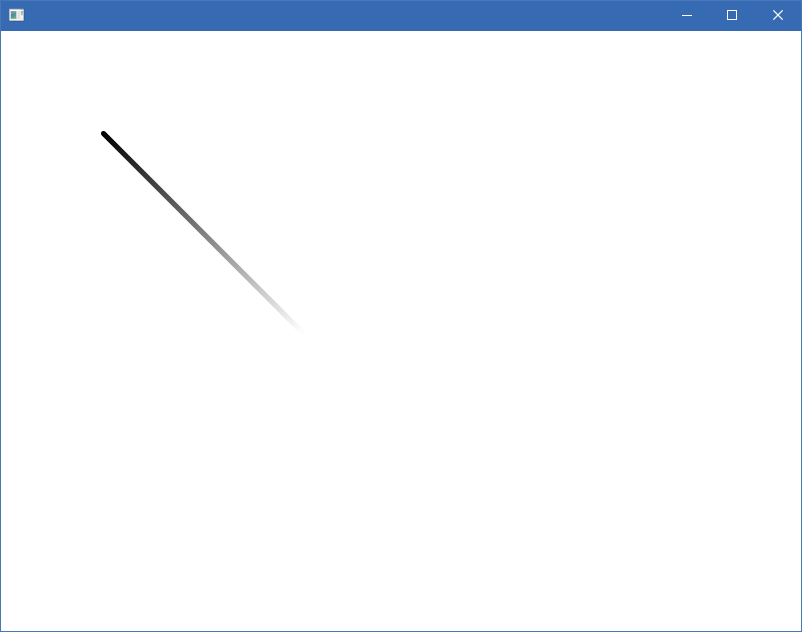

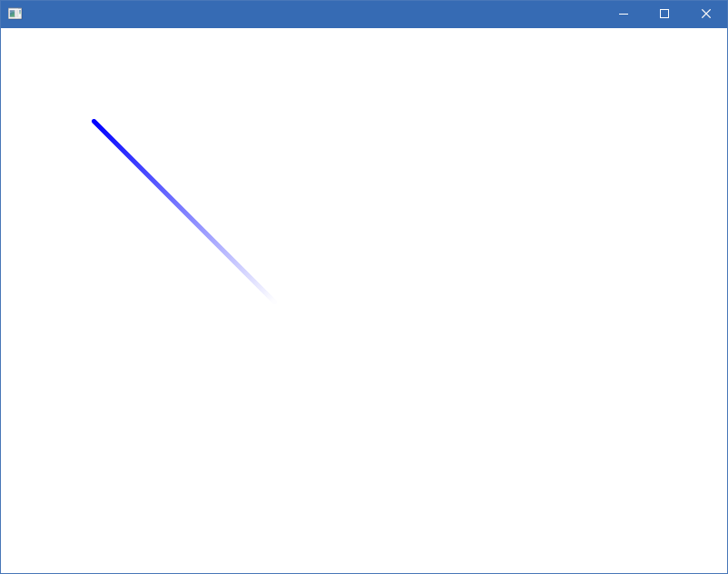

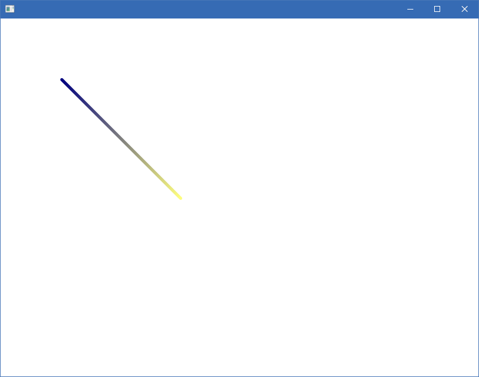

##### 2.灰色背景出现9个方格

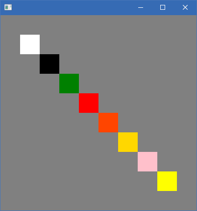

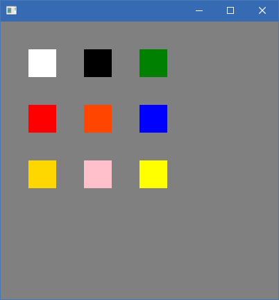

#### 四.填充

画一个房子

